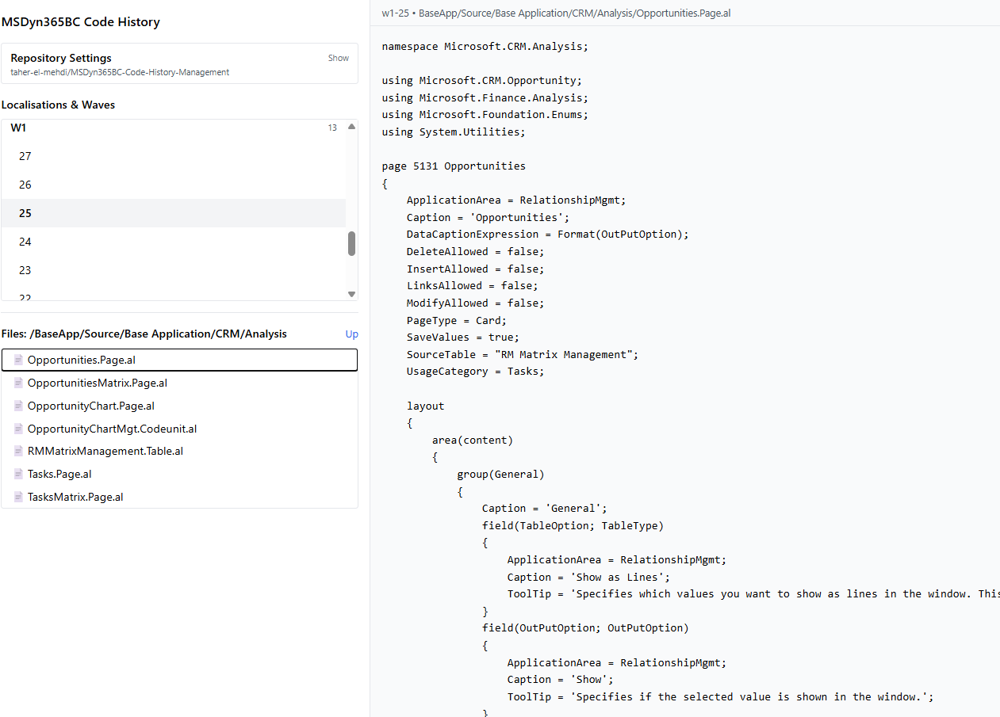

# MSDyn365BC Code History Manager

A lightweight web app for exploring Microsoft Dynamics 365 Business Central source code from GitHub repository [MSDyn365BC.Code.History](https://github.com/StefanMaron/MSDyn365BC.Code.History).

This project is possible due to the excellent work of [**Stefan Maron**](https://www.linkedin.com/in/stefan-maron-709928206/), with his repository of [MSDyn365BC.Code.History](https://github.com/StefanMaron/MSDyn365BC.Code.History) which collect the historical source code of Microsoft Dynamics 365 Business Central across versions and localisations. 🙌

### [Demo]()

> Note: Diff viewing is planned. Current features below are available now.
## Features

* **Localisations & Waves**
  Group branches by localisation (prefix) and list their waves/versions (suffix after `-`).
* **Repository browser**
  Navigate folders and open files from any selected branch.
* **Version switching**
  When changing a wave/version, the currently open file reloads for the selected branch.
* **Helpful error handling**

  * 404 when a file doesn’t exist in a branch
  * friendly rate-limit guidance with reset time

## Tech Stack

* React 18 + TypeScript 5
* Vite 5 (dev server & build)
* Tailwind CSS 3 (styling)
* GitHub REST API (data source)

## Configuration

If you encounter a rate-limit error, fork **Stefan Maron’s repository** [MSDyn365BC.Code.History](https://github.com/StefanMaron/MSDyn365BC.Code.History) and add a **Personal Access Token** to this app in **Repository Settings** (see Configuration below).